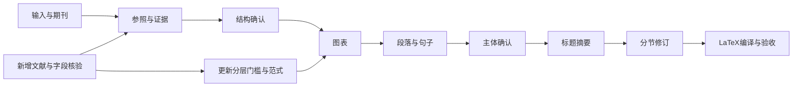

# SCI Writing Workflow

面向英文 SCI 综述与原研论文的证据驱动写作流程。中文工作说明，英文稿件；从已有研究和真实文献出发，依次完成结构、图表、段落、句式、摘要和 LaTeX 成品。

**状态：v0.1.0。流程可以执行；各领域的一区数量门槛尚待可比样本校准。** 不承诺录用，不把固定图数或字数当作学术质量证明。

## 开始使用

1. 阅读 [完整 Workflow](docs/workflow.md)。
2. 复制 [项目任务卡](templates/project.md) 和 [阶段验收表](templates/gates.csv)，填写目标期刊、文体、方法、已有材料和缺口。
3. 使用 [执行提示词](prompts/execute.md)，按阶段交付。结构和主体分别确认后进入后续写作。
4. 用 [工作量表](templates/workload.csv) 记录真实样本，不把未知填成零。
   用 [证据与缺口矩阵](templates/evidence-gap-matrix.md) 将样文分析转为本稿可执行计划。
5. 按 [维护规范](CONTRIBUTING.md) 更新流程与证据。

支持技能的助手可使用 [skill](skills/sci-writing-workflow/SKILL.md)。它不依赖特定模型或商业平台；自动化工具和终端监督不是运行本流程的前提。

## 流程

## 核心规则

- 原研使用作者已有数据；综述使用可核验文献。缺材料明确记录，不编造。
- 图、面板、指标、实验模块、数据集和独立队列分别计数。
- 官方要求、样文观察值和项目目标分开；工作量统计按学科、文体、方法及时间分层。
- 不强制每段自我反驳；保留真实反证和科学边界。
- 提示词与内部审计不进入投稿内容；AI使用按期刊政策如实披露。
- LaTeX为排版主源，表格可编辑，实际编译并检查成品。
- 先交可执行流程，全库文献扩样持续更新，不无限推迟作者可用成果。

公开仓库不包含私人稿件、论文PDF、论文原图、下载信息或凭据。文献事实案例的权利仍属于原权利人。

## 许可证

本仓库原创流程、提示词和代码采用 [MIT License](LICENSE)。第三方论文及其图表不在此授权范围内。
